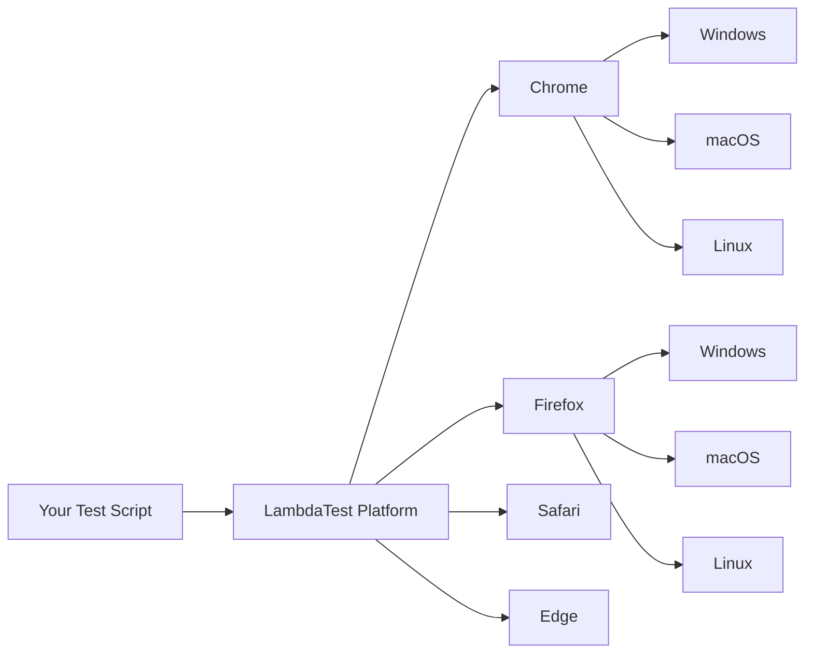
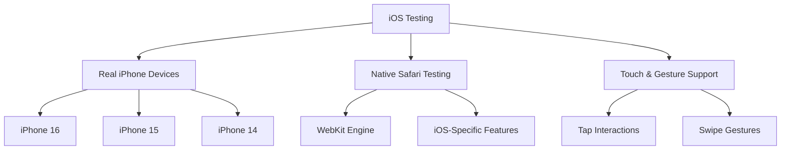
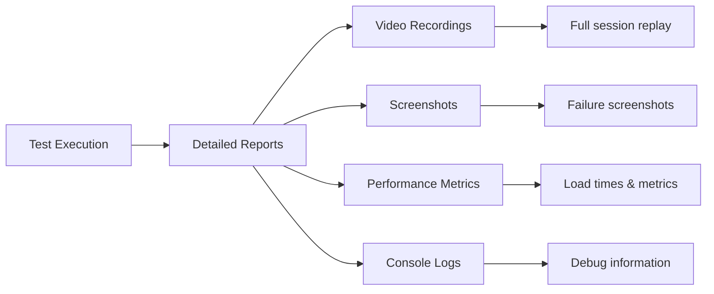

# �� Playwright Testing on LambdaTest Cloud


<p align="center">
  
</p>

<p align="center">
  <a href="https://www.lambdatest.com/blog/?utm_source=github&utm_medium=repo&utm_campaign=playwright-sample" target="_bank">📚 Blog</a>
  &nbsp; &#8901; &nbsp;
  <a href="https://www.lambdatest.com/support/docs/?utm_source=github&utm_medium=repo&utm_campaign=playwright-sample" target="_bank">📖 Docs</a>
  &nbsp; &#8901; &nbsp;
  <a href="https://www.lambdatest.com/learning-hub/?utm_source=github&utm_medium=repo&utm_campaign=playwright-sample" target="_bank">🎓 Learning Hub</a>
  &nbsp; &#8901; &nbsp;
  <a href="https://www.lambdatest.com/newsletter/?utm_source=github&utm_medium=repo&utm_campaign=playwright-sample" target="_bank">📰 Newsletter</a>
  &nbsp; &#8901; &nbsp;
  <a href="https://www.lambdatest.com/certifications/?utm_source=github&utm_medium=repo&utm_campaign=playwright-sample" target="_bank">🏆 Certifications</a>
  &nbsp; &#8901; &nbsp;
  <a href="https://www.youtube.com/c/LambdaTest" target="_bank">🎥 YouTube</a>
</p>

## 📋 Table of Contents

- [🚀 Quick Start](#-quick-start)
- [🎯 Testing Capabilities](#-testing-capabilities)
- [📱 Platform Coverage](#-platform-coverage)
- [⚙️ Setup Guide](#️-setup-guide)
- [🎪 Test Examples](#-test-examples)
- [📊 Results & Reporting](#-results--reporting)
- [🏆 Best Practices](#-best-practices)
- [📚 Resources](#-resources)

## 🚀 Quick Start

Get started with Playwright testing on LambdaTest in under 5 minutes:

```bash
# 1. Clone the sample repository
git clone https://github.com/LambdaTest/playwright-sample.git
cd playwright-sample

# 2. Install dependencies
npm install

# 3. Set up your credentials and run your first test
node playwright-single.js
```

## 🎯 Testing Capabilities

### 🌐 **Cross-Browser Testing**

Test across multiple browsers and operating systems simultaneously:



### 📱 **Mobile Testing Excellence**

#### 🍎 **iOS Real Device Testing**

Experience authentic iOS testing on actual iPhone hardware:



**Key Benefits:**
- ✅ **Authentic Experience**: Test on real iPhone hardware, not simulators
- ✅ **Latest Devices**: iPhone 16, 15, 14 with iOS 18, 17, 16
- ✅ **Native Performance**: True Safari WebKit engine behavior
- ✅ **Touch Accuracy**: Precise touch and gesture interactions

#### 🤖 **Android Real Device Testing**

Comprehensive Android testing across various device manufacturers:

- **Real Hardware**: Galaxy S21, Pixel devices, and more
- **Multiple Android Versions**: Android 12, 11, 10
- **WebView Support**: Test hybrid applications
- **Native Interactions**: Touch, gestures, and device-specific features

## 📱 Platform Coverage

### 🖥️ **Desktop Browser Tests**

| Test File | Purpose | Platforms |
|-----------|---------|-----------|
| `playwright-single.js` | Single browser testing | Chrome, Firefox, Safari, Edge |
| `playwright-parallel.js` | Parallel cross-browser testing | All major browsers simultaneously |

### 📱 **Mobile Device Tests**

| Test File | Device Type | Key Features |
|-----------|-------------|--------------|
| `playwright-ios-real-device.js` | iPhone 16 (Real Device) | Safari WebKit, Touch interactions |
| `playwright-android-real-device.js` | Galaxy S21 (Real Device) | Chrome browser, Android gestures |
| `playwright-single-on-iphone.js` | iPhone Emulation | Quick mobile testing |
| `playwrightwebview.js` | Android WebView | Hybrid app testing |

### 🧪 **Advanced Testing Features**

| Test File | Capability | Business Value |
|-----------|------------|----------------|
| `playwright-extensions-test.js` | Browser Extension Testing | Validate Chrome extensions |
| `playwright-lighthouse-report.js` | Performance Testing | Measure page speed & SEO |
| `playwright-smartui.js` | Visual Regression Testing | Catch visual bugs automatically |

### 🔧 **Framework Integration**

| Directory | Framework | Use Case |
|-----------|-----------|----------|
| `playwright-test-js/` | Playwright Test Runner | Built-in test organization |
| `playwright-test-ts/` | TypeScript Support | Type-safe testing |
| `playwright-cucumber-js/` | BDD Testing | Behavior-driven development |
| `playwright-jest-js/` | Jest Integration | JavaScript testing ecosystem |

## ⚙️ Setup Guide

### 📋 Prerequisites

1. **Node.js** (v14 or higher) - [Download here](https://nodejs.org/)
2. **LambdaTest Account** - [Sign up free](https://accounts.lambdatest.com/register)
3. **Your LambdaTest Credentials** - Available in your dashboard

### 🔐 Configuration

Create a `.env` file in your project root:

```env
# Your LambdaTest credentials
LT_USERNAME=your_username
LT_ACCESS_KEY=your_access_key

# Optional: iOS-specific settings
LT_DEVICE_NAME=iPhone 16
LT_PLATFORM_VERSION=18
LT_PROJECT_NAME=My iOS Tests
```

### 📦 Installation

```bash
# Install project dependencies
npm install

# Optional: Install Playwright browsers for local development
npx playwright install
```

## 🎪 Test Examples

### 🖥️ **Cross-Browser Testing**

```bash
# Single browser test
node playwright-single.js

# Run the same test across multiple browsers
node playwright-parallel.js
```

### 📱 **Mobile Testing**

```bash
# Test on real iPhone 16
node playwright-ios-real-device.js

# Test on real Android device
node playwright-android-real-device.js

# Quick mobile emulation
node playwright-single-on-iphone.js
```

### 🧪 **Specialized Testing**

```bash
# Performance testing with Lighthouse
node playwright-lighthouse-report.js

# Visual regression testing
node playwright-smartui.js

# Browser extension testing
node playwright-extensions-test.js
```

### 🔧 **Framework-Based Testing**

```bash
# Using Playwright Test Runner
cd playwright-test-js && npx playwright test

# TypeScript testing
cd playwright-test-ts && npx playwright test

# BDD with Cucumber
cd playwright-cucumber-js && npm test

# Jest integration
cd playwright-jest-js && npm test
```

## 📊 Results & Reporting

### 🎯 **Comprehensive Test Insights**

Every test execution provides:



**What You Get:**
- 📹 **HD Video Recording**: Watch exactly what happened during your test
- 📊 **Performance Metrics**: Load times, network activity, resource usage
- 🖼️ **Automatic Screenshots**: Capture failures and key test moments
- 📋 **Detailed Logs**: Console outputs, network requests, errors
- 📈 **Analytics Dashboard**: Test trends, success rates, team insights

### 🔍 **iOS Testing Results**

When running iOS tests, you'll see:
- ✅ **Real Device Information**: Actual iPhone model and iOS version
- 👆 **Touch Interaction Logs**: Tap, swipe, and gesture confirmations  
- 🍎 **Safari-Specific Metrics**: WebKit performance data
- 📱 **Mobile-Optimized Reports**: Tailored for mobile testing insights

## 🏆 Best Practices

### 📱 **iOS Testing Excellence**

```javascript
// Recommended iOS test structure
const capabilities = {
  "LT:Options": {
    "platformName": "ios",
    "deviceName": "iPhone 16",
    "platformVersion": "18",
    "isRealMobile": true,
    "build": "Production iOS Tests",
    "name": "Critical User Journey",
    "network": true,
    "video": true
  }
};

// iOS-optimized interactions
const context = await browser.newContext({
  hasTouch: true,
  isMobile: true
});

// Reliable iOS element interactions
await page.locator('input[name="search"]').click();
await page.locator('input[name="search"]').fill('test query');
await page.locator('button[type="submit"]').click();
```

### ⚡ **Performance Optimization**

- **Parallel Execution**: Run tests simultaneously across multiple browsers
- **Smart Timeouts**: Use appropriate timeouts for real device testing
- **Resource Management**: Proper cleanup ensures consistent performance
- **Error Handling**: Robust error handling for stable test execution

### 🎯 **Test Organization**

- **Descriptive Names**: Clear test and build names for easy identification
- **Logical Grouping**: Organize tests by feature, platform, or priority
- **Environment Configuration**: Separate configs for dev, staging, production
- **Version Control**: Track test changes alongside application code

## 📚 Resources

### 📖 **Documentation & Guides**

- [🔄 Migrate Existing Tests](pw-docs/migrate-playwright-tests.md)
- [⚙️ Advanced Configuration](pw-docs/test-execution-setup.md)
- [🌐 Local Testing Setup](pw-docs/local-testing.md)
- [🧪 Test Runner Integration](pw-docs/playwright-test-runner.md)
- [🥒 BDD with Cucumber](pw-docs/cucumberjs.md)
- [🔄 CI/CD Pipeline Integration](pw-docs/playwright-with-cicd.md)

### 🎓 **Learning & Support**

- [📚 LambdaTest Documentation](https://www.lambdatest.com/support/docs/)
- [📝 Testing Blog & Tutorials](https://www.lambdatest.com/blog/)
- [🎓 Free Testing Courses](https://www.lambdatest.com/learning-hub/)
- [🏆 Testing Certifications](https://www.lambdatest.com/certifications/)

### 💬 **Community & Help**

- [Community Forum](https://community.lambdatest.com/) - Connect with testing professionals
- [24/7 Support](mailto:support@lambdatest.com) - Get expert help anytime
- [GitHub Issues](https://github.com/LambdaTest/playwright-sample/issues) - Report issues or request features

## 🚀 Try in Gitpod

Experience Playwright testing instantly with our pre-configured environment:

[](https://gitpod.io/#https://github.com/LambdaTest/playwright-sample)

```bash
# Set your credentials in Gitpod
eval $(gp env -e LT_USERNAME=your_username)
eval $(gp env -e LT_ACCESS_KEY=your_access_key)
```

## 🌟 Why Choose LambdaTest for Playwright Testing?

### ✨ **Enterprise-Grade Platform**

- 🌐 **3000+ Browser-OS Combinations** - Comprehensive coverage
- 📱 **Real Device Cloud** - Authentic testing on actual devices
- ⚡ **HyperExecute** - Fastest test orchestration platform
- 🎯 **Smart Test Analytics** - AI-powered insights and optimization
- 🔧 **120+ Integrations** - Seamless workflow integration

### 📊 **Trusted Globally**

- **500+ Enterprises** rely on LambdaTest for critical testing
- **1M+ Developers** worldwide use our platform
- **99.9% Uptime** ensuring your tests run when you need them

[](https://accounts.lambdatest.com/register?utm_source=github&utm_medium=repo&utm_campaign=playwright-sample)

---

<p align="center">
  <b>🎭 Start Testing with Playwright on LambdaTest Today! 🚀</b>
</p>
