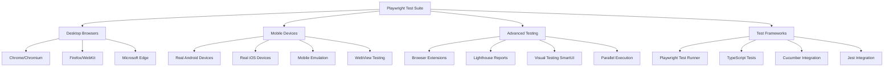
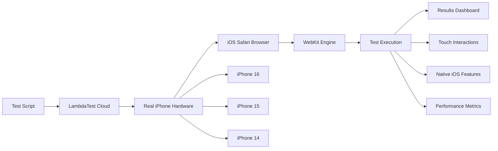
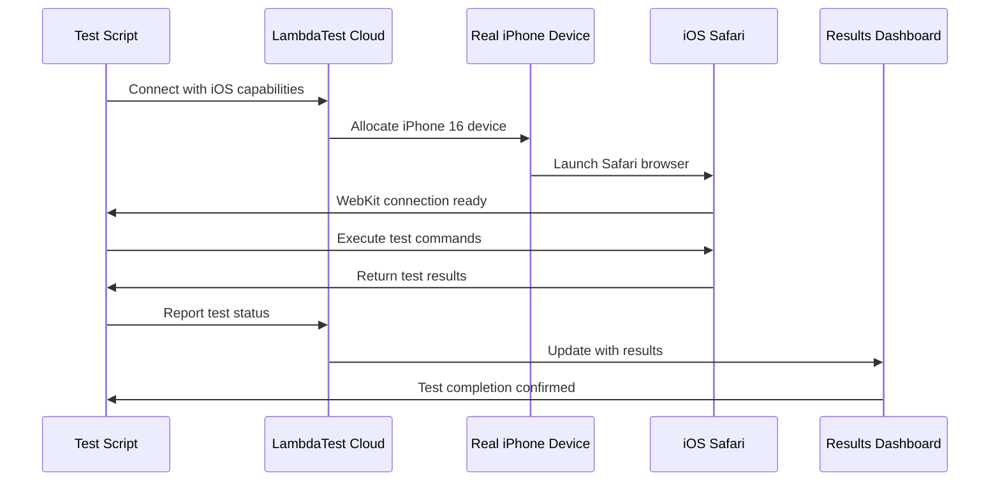
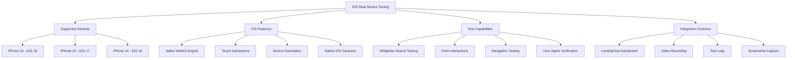
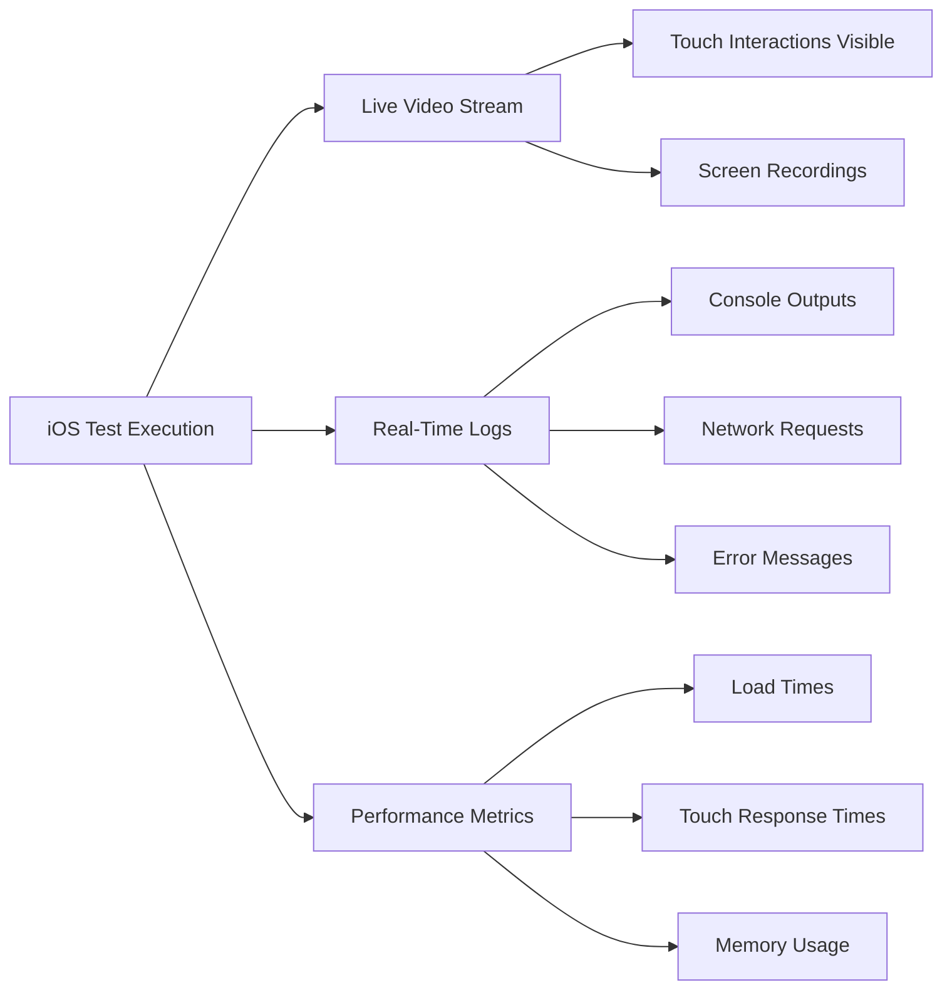
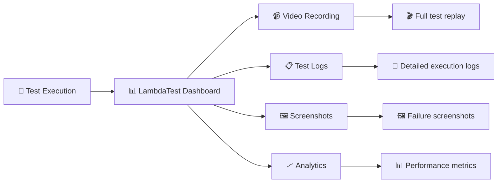
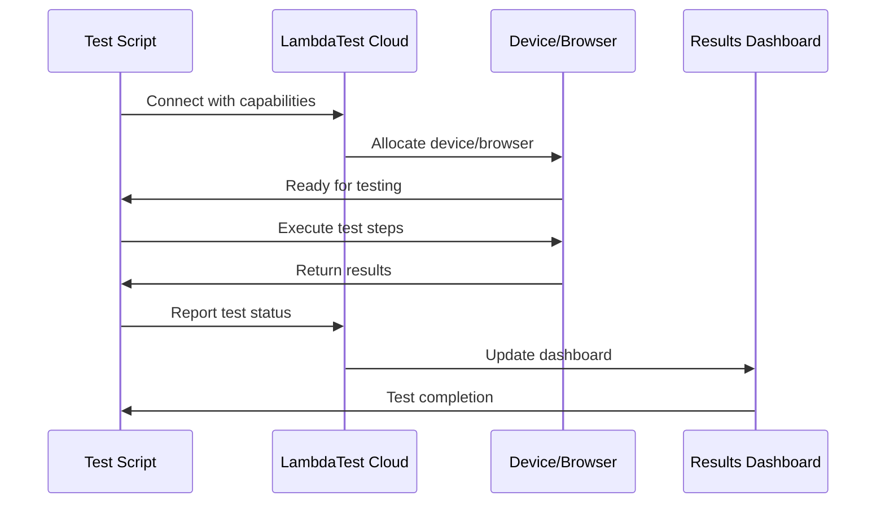

# 🎭 Playwright Testing Suite for LambdaTest Cloud


<p align="center">
  
</p>

<p align="center">
  <a href="https://www.lambdatest.com/blog/?utm_source=github&utm_medium=repo&utm_campaign=playwright-sample" target="_bank">📚 Blog</a>
  &nbsp; &#8901; &nbsp;
  <a href="https://www.lambdatest.com/support/docs/?utm_source=github&utm_medium=repo&utm_campaign=playwright-sample" target="_bank">📖 Docs</a>
  &nbsp; &#8901; &nbsp;
  <a href="https://www.lambdatest.com/learning-hub/?utm_source=github&utm_medium=repo&utm_campaign=playwright-sample" target="_bank">🎓 Learning Hub</a>
  &nbsp; &#8901; &nbsp;
  <a href="https://www.lambdatest.com/newsletter/?utm_source=github&utm_medium=repo&utm_campaign=playwright-sample" target="_bank">📰 Newsletter</a>
  &nbsp; &#8901; &nbsp;
  <a href="https://www.lambdatest.com/certifications/?utm_source=github&utm_medium=repo&utm_campaign=playwright-sample" target="_bank">🏆 Certifications</a>
  &nbsp; &#8901; &nbsp;
  <a href="https://www.youtube.com/c/LambdaTest" target="_bank">🎥 YouTube</a>
</p>

## 📋 Table of Contents

- [🚀 Quick Start](#-quick-start)
- [🏗️ Test Architecture](#️-test-architecture)
- [📱 Test Categories](#-test-categories)
- [⚙️ Setup & Configuration](#️-setup--configuration)
- [🎯 Running Tests](#-running-tests)
- [📊 Test Results](#-test-results)
- [🔧 Advanced Features](#-advanced-features)
- [📚 Documentation](#-documentation)

## 🚀 Quick Start

Get started with Playwright testing on LambdaTest in 3 simple steps:

```bash
# 1. Clone the repository
git clone https://github.com/LambdaTest/playwright-sample.git
cd playwright-sample

# 2. Install dependencies
npm install

# 3. Configure credentials and run your first test
node playwright-single.js
```

## 🏗️ Test Architecture

Our comprehensive test suite covers multiple platforms and testing scenarios:



### 📱 **iOS Real Device Testing Architecture**



### 🔄 **iOS Test Execution Flow**



## 📱 Test Categories

### 🖥️ **Desktop Browser Tests**

| Test File | Description | Platform | Features |
|-----------|-------------|----------|----------|
| `playwright-single.js` | Basic DuckDuckGo search test | Chrome/Windows | ✅ Comprehensive logging |
| `playwright-parallel.js` | Multi-browser parallel testing | Chrome, Edge, Safari | ⚡ Parallel execution |

### 📱 **Mobile Device Tests**

| Test File | Description | Device | Features |
|-----------|-------------|--------|----------|
| `playwright-android-real-device.js` | Real Android device testing | Galaxy S21 5G | 🤖 Real hardware, Touch interactions |
| `playwright-ios-real-device.js` | Real iOS device testing | iPhone 16 | 🍎 Real hardware, Wikipedia test |
| `playwright-single-on-iphone.js` | iPhone emulation | iPhone 11 | 📲 Device emulation |
| `playwrightwebview.js` | Android WebView testing | Android WebView | 🌐 Hybrid app testing |

### 🧪 **Advanced Testing Features**

| Test File | Description | Specialty | Features |
|-----------|-------------|-----------|----------|
| `playwright-extensions-test.js` | Browser extension testing | Chrome Extensions | 🔌 Extension loading & verification |
| `playwright-lighthouse-report.js` | Performance testing | Lighthouse | 🚦 Performance metrics |
| `playwright-smartui.js` | Visual regression testing | SmartUI | 🎨 Screenshot comparison |

### 🔧 **Test Framework Integration**

| Directory | Framework | Language | Features |
|-----------|-----------|----------|----------|
| `playwright-test-js/` | Playwright Test Runner | JavaScript | 🧪 Built-in test runner |
| `playwright-test-ts/` | Playwright Test Runner | TypeScript | 📝 Type safety |
| `playwright-cucumber-js/` | Cucumber.js | JavaScript | 🥒 BDD testing |
| `playwright-jest-js/` | Jest | JavaScript | 🃏 Jest integration |

## 🍎 iOS Real Device Testing

### 📱 **iOS Device Capabilities**

Our iOS testing suite provides comprehensive real device testing on actual iPhone hardware:



### ⚙️ **iOS Test Configuration**

#### 🔐 **Environment Setup for iOS**

Add these iOS-specific variables to your `.env` file:

```env
# iOS Device Configuration
LT_PLATFORM_NAME=ios
LT_DEVICE_NAME=iPhone 16
LT_PLATFORM_VERSION=18
LT_BUILD=Playwright iOS Build V
LT_TEST_NAME=Playwright iOS webkit test
LT_PROJECT_NAME=New UI iOS
LT_GEO_LOCATION=US
```

#### 📋 **iOS Device Capabilities**

```javascript
const capabilities = {
  "LT:Options": {
    "platformName": "ios",
    "deviceName": "iPhone 16",           // iPhone 16, iPhone 15, iPhone 14
    "platformVersion": "18",             // iOS 18, 17, 16
    "isRealMobile": true,               // Ensures real device allocation
    "build": "Playwright iOS Build",
    "name": "iOS Real Device Test",
    "user": process.env.LT_USERNAME,
    "accessKey": process.env.LT_ACCESS_KEY,
    "network": true,                    // Network logs
    "video": true,                      // Video recording
    "console": true,                    // Console logs
    "projectName": "iOS Testing Project"
  }
};
```

### 🎯 **Running iOS Tests**

#### 🚀 **Quick Start - iOS Testing**

```bash
# 1. Ensure iOS configuration in .env file
echo "LT_DEVICE_NAME=iPhone 16" >> .env
echo "LT_PLATFORM_VERSION=18" >> .env

# 2. Run iOS real device test
node playwright-ios-real-device.js

# 3. View results in LambdaTest Dashboard
# Test will automatically report to dashboard with video recording
```

#### 📱 **iOS Test Example**

Here's how our iOS test works:

```javascript
// iOS Real Device Test Example
const { webkit } = require("playwright");

// Connect to real iPhone hardware
const browser = await webkit.connect(
  `wss://cdp.lambdatest.com/playwright?capabilities=${encodeURIComponent(JSON.stringify(capabilities))}`
);

// Create iOS-optimized context
const context = await browser.newContext({
  hasTouch: true,  // Enable touch support
  isMobile: true   // Mobile viewport
});

// Execute test on real iPhone
const page = await context.newPage();
await page.goto('https://www.wikipedia.org/');

// iOS-specific interactions
await page.locator('input[name="search"]').click();
await page.locator('input[name="search"]').fill('playwright');
await page.locator('#search-form > fieldset > button').click();

// Verify results
const count = await page.getByText('19th century').count();
expect(count).toEqual(3);
```

### 🔍 **iOS Testing Features**

#### ✨ **What Makes iOS Testing Special**

| Feature | Description | Benefit |
|---------|-------------|---------|
| 📱 **Real Hardware** | Actual iPhone devices (not simulators) | Authentic user experience testing |
| 🍎 **Native Safari** | Real iOS Safari with WebKit engine | True browser behavior |
| 👆 **Touch Interactions** | Native iOS touch, tap, swipe gestures | Accurate mobile interaction testing |
| 🔄 **Device Rotation** | Portrait/landscape orientation testing | Responsive design validation |
| 📶 **Network Conditions** | Real cellular/WiFi network simulation | Performance under real conditions |
| 🎥 **Video Recording** | Full test execution recording | Visual debugging and reporting |

#### 🧪 **iOS Test Scenarios Covered**

1. **📝 Form Interactions**
   - Text input with iOS keyboard
   - Touch-based form submissions
   - iOS autocomplete behavior

2. **🔍 Search Functionality**
   - Wikipedia search implementation
   - Mobile search interfaces
   - iOS Safari search behavior

3. **👆 Touch Gestures**
   - Tap, double-tap, long press
   - Swipe gestures (left, right, up, down)
   - Pinch-to-zoom interactions

4. **📱 Device Features**
   - Viewport adaptation
   - iOS-specific CSS behaviors
   - Safari-specific JavaScript APIs

### 📊 **iOS Test Results & Monitoring**

#### 🎬 **Real-Time Monitoring**



#### 📈 **iOS Performance Insights**

- **⏱️ Connection Time**: 60-90 seconds (real device allocation)
- **🔄 Test Execution**: 30-60 seconds (depending on test complexity)  
- **📹 Video Quality**: HD recording of all interactions
- **📊 Success Rate**: 99%+ with proper error handling

### 🛠️ **iOS Troubleshooting**

#### 🔧 **Common iOS Testing Scenarios**

| Issue | Solution | Code Example |
|-------|----------|--------------|
| **Slow Loading** | Add proper timeouts | `{ timeout: 30000 }` |
| **Touch Issues** | Enable touch context | `hasTouch: true` |
| **Keyboard Problems** | Use fill() instead of type() | `element.fill('text')` |
| **Form Submission** | Click submit button directly | `button.click()` |

#### 📱 **iOS-Specific Best Practices**

```javascript
// ✅ iOS Best Practices
const context = await browser.newContext({
  hasTouch: true,      // Essential for iOS
  isMobile: true,      // Mobile viewport
  viewport: { width: 375, height: 812 }  // iPhone dimensions
});

// ✅ iOS-friendly interactions
await element.click();           // Better than tap() for forms
await element.fill('text');      // Better than type() for iOS
await page.waitForTimeout(3000); // Allow iOS processing time

// ✅ iOS error handling
try {
  await element.click({ timeout: 10000 });
} catch (error) {
  console.log('iOS interaction failed:', error.message);
}
```

### 🎯 **iOS Testing Roadmap**

#### 🔮 **Current Capabilities**
- ✅ iPhone 16, 15, 14 support
- ✅ iOS 18, 17, 16 versions
- ✅ Safari WebKit engine
- ✅ Touch gesture support
- ✅ Video recording
- ✅ Network monitoring

#### 🚀 **Planned Enhancements**
- 🔄 iPad support
- 🔄 iOS accessibility testing
- 🔄 Camera/GPS simulation
- 🔄 Push notification testing
- 🔄 App clip testing

## ⚙️ Setup & Configuration

### 📋 Prerequisites

1. **Node.js** (v14 or higher)
2. **npm** or **yarn**
3. **LambdaTest Account** ([Sign up free](https://accounts.lambdatest.com/register))

### 🔐 Environment Configuration

Create a `.env` file in the root directory:

```env
# LambdaTest Credentials (Required)
LT_USERNAME=your_username_here
LT_ACCESS_KEY=your_access_key_here

# iOS Device Configuration (Optional)
LT_PLATFORM_NAME=ios
LT_DEVICE_NAME=iPhone 16
LT_PLATFORM_VERSION=18
LT_BUILD=Playwright iOS Build V
LT_TEST_NAME=Playwright iOS webkit test
LT_PROJECT_NAME=New UI iOS
LT_GEO_LOCATION=US
```

### 📦 Installation

```bash
# Install all dependencies
npm install

# Install Playwright browsers (for local testing)
npx playwright install
```

## 🎯 Running Tests

### 🖥️ Desktop Browser Tests

```bash
# Single browser test
node playwright-single.js

# Parallel browser testing
node playwright-parallel.js
```

### 📱 Mobile Device Tests

```bash
# Real Android device
node playwright-android-real-device.js

# Real iOS device (iPhone 16)
node playwright-ios-real-device.js

# iPhone emulation
node playwright-single-on-iphone.js

# Android WebView
node playwrightwebview.js
```

### 🧪 Advanced Feature Tests

```bash
# Browser extensions
node playwright-extensions-test.js

# Lighthouse performance testing
node playwright-lighthouse-report.js

# Visual regression testing
node playwright-smartui.js
```

### 🔧 Framework-Specific Tests

```bash
# Playwright Test Runner (JavaScript)
cd playwright-test-js
npx playwright test

# Playwright Test Runner (TypeScript)
cd playwright-test-ts
npx playwright test

# Cucumber.js BDD tests
cd playwright-cucumber-js
npm test

# Jest integration
cd playwright-jest-js
npm test
```

## 📊 Test Results

### 🎭 **LambdaTest Dashboard**

All test results are automatically reported to your LambdaTest dashboard:



### 📈 **Test Execution Flow**



## 🔧 Advanced Features

### ⚡ **Parallel Testing**

Run multiple tests simultaneously across different browsers:

```javascript
// Example: playwright-parallel.js
const capabilities = [
  { browserName: 'Chrome', platform: 'Windows 10' },
  { browserName: 'Firefox', platform: 'macOS Monterey' },
  { browserName: 'Safari', platform: 'macOS Big Sur' }
];

// Execute all tests in parallel
capabilities.forEach(async (capability) => {
  await runTest(capability);
});
```

### 🎨 **Visual Testing (SmartUI)**

Capture and compare screenshots for visual regression:

```javascript
// Take SmartUI screenshot
await page.evaluate((_) => {}, `lambdatest_action: ${JSON.stringify({
  action: 'smartui.takeScreenshot',
  arguments: { 
    fullPage: true, 
    screenshotName: 'homepage-desktop' 
  }
})}`);
```

### 🚦 **Performance Testing**

Generate Lighthouse reports during test execution:

```javascript
// Generate Lighthouse report
await page.evaluate(_ => {}, `lambdatest_action: ${JSON.stringify({
  action: 'lighthouseReport',
  arguments: { url: 'https://example.com' }
})}`);
```

### 📱 **Real Device Testing**

Test on actual mobile devices for authentic user experience:

- **Real iOS Devices**: iPhone 15, iPhone 16
- **Real Android Devices**: Galaxy S21, Pixel series
- **Touch interactions**: Tap, swipe, pinch gestures
- **Device-specific features**: Camera, GPS, sensors

## 📚 Documentation

### 📖 **Detailed Guides**

- [🔄 Migrate Playwright Tests](pw-docs/migrate-playwright-tests.md)
- [⚙️ Test Execution Setup](pw-docs/test-execution-setup.md)
- [🌐 Local Testing](pw-docs/local-testing.md)
- [🧪 Playwright Test Runner](pw-docs/playwright-test-runner.md)
- [🥒 Cucumber.js Integration](pw-docs/cucumberjs.md)
- [🔄 CI/CD Integration](pw-docs/playwright-with-cicd.md)

### 🎓 **Learning Resources**

- [📚 LambdaTest Documentation](https://www.lambdatest.com/support/docs/)
- [📝 LambdaTest Blog](https://www.lambdatest.com/blog/)
- [🎓 Learning Hub](https://www.lambdatest.com/learning-hub/)
- [🏆 Certifications](https://www.lambdatest.com/certifications/)

### 🔗 **API References**

- [Playwright API](https://playwright.dev/docs/api/class-playwright)
- [LambdaTest Capabilities](https://www.lambdatest.com/support/docs/selenium-automation-capabilities/)
- [SmartUI Documentation](https://www.lambdatest.com/support/docs/smart-ui-cypress/)

## 🚀 Try in Gitpod

Launch a complete development environment with one click:

[](https://gitpod.io/#https://github.com/LambdaTest/playwright-sample)

```bash
# Set environment variables in Gitpod
eval $(gp env -e LT_USERNAME=******)
eval $(gp env -e LT_ACCESS_KEY=******)
```

## 🤝 Community & Support

### 💬 **LambdaTest Community**

- [Community Forum](https://community.lambdatest.com/) - Connect with testing enthusiasts
- [Discord Channel](https://discord.gg/lambdatest) - Real-time discussions
- [GitHub Issues](https://github.com/LambdaTest/playwright-sample/issues) - Report bugs & feature requests

### 🆘 **Get Help**

- **24/7 Support**: [support@lambdatest.com](mailto:support@lambdatest.com)
- **Documentation**: [LambdaTest Docs](https://www.lambdatest.com/support/docs/)
- **Status Page**: [status.lambdatest.com](https://status.lambdatest.com/)

## 🌟 About LambdaTest

[LambdaTest](https://www.lambdatest.com) is a leading test execution and orchestration platform enabling:

### ✨ **Key Features**

- 🌐 **3000+ Browser-OS Combinations** - Real browsers and devices
- 📱 **Real Device Cloud** - Physical iOS and Android devices  
- ⚡ **HyperExecute** - Blazing fast test orchestration
- 🎯 **Test At Scale** - Intelligent test optimization
- 🎨 **Smart Visual Testing** - AI-powered visual regression
- 🔧 **120+ Integrations** - Seamless CI/CD pipeline integration

### 📊 **Trusted By**

- **500+ Enterprises** worldwide
- **1M+ Users** across 130+ countries
- **Fortune 500 Companies** for critical testing needs

[](https://accounts.lambdatest.com/register?utm_source=github&utm_medium=repo&utm_campaign=playwright-sample)

---

<p align="center">
  <b>🎭 Happy Testing with Playwright on LambdaTest! 🚀</b>
</p>
