# 🎭 Playwright Testing Suite for LambdaTest Cloud


<p align="center">
  
</p>

<p align="center">
  <a href="https://www.lambdatest.com/blog/?utm_source=github&utm_medium=repo&utm_campaign=playwright-sample" target="_bank">📚 Blog</a>
  &nbsp; &#8901; &nbsp;
  <a href="https://www.lambdatest.com/support/docs/?utm_source=github&utm_medium=repo&utm_campaign=playwright-sample" target="_bank">📖 Docs</a>
  &nbsp; &#8901; &nbsp;
  <a href="https://www.lambdatest.com/learning-hub/?utm_source=github&utm_medium=repo&utm_campaign=playwright-sample" target="_bank">🎓 Learning Hub</a>
  &nbsp; &#8901; &nbsp;
  <a href="https://www.lambdatest.com/newsletter/?utm_source=github&utm_medium=repo&utm_campaign=playwright-sample" target="_bank">📰 Newsletter</a>
  &nbsp; &#8901; &nbsp;
  <a href="https://www.lambdatest.com/certifications/?utm_source=github&utm_medium=repo&utm_campaign=playwright-sample" target="_bank">🏆 Certifications</a>
  &nbsp; &#8901; &nbsp;
  <a href="https://www.youtube.com/c/LambdaTest" target="_bank">🎥 YouTube</a>
</p>

## 📋 Table of Contents

- [🚀 Quick Start](#-quick-start)
- [🏗️ Test Architecture](#️-test-architecture)
- [📱 Test Categories](#-test-categories)
- [⚙️ Setup & Configuration](#️-setup--configuration)
- [🎯 Running Tests](#-running-tests)
- [📊 Test Results](#-test-results)
- [🔧 Advanced Features](#-advanced-features)
- [📚 Documentation](#-documentation)

## 🚀 Quick Start

Get started with Playwright testing on LambdaTest in 3 simple steps:

```bash
# 1. Clone the repository
git clone https://github.com/LambdaTest/playwright-sample.git
cd playwright-sample

# 2. Install dependencies
npm install

# 3. Configure credentials and run your first test
node playwright-single.js
```

## 🏗️ Test Architecture

Our comprehensive test suite covers multiple platforms and testing scenarios:

```mermaid
graph TB
    A[🎭 Playwright Test Suite] --> B[🖥️ Desktop Browsers]
    A --> C[📱 Mobile Devices]
    A --> D[🧪 Advanced Testing]
    A --> E[🔧 Test Frameworks]
    
    B --> B1[Chrome/Chromium]
    B --> B2[Firefox/WebKit]
    B --> B3[Microsoft Edge]
    
    C --> C1[📱 Real Android Devices]
    C --> C2[🍎 Real iOS Devices]
    C --> C3[📲 Mobile Emulation]
    C --> C4[🌐 WebView Testing]
    
    D --> D1[🔌 Browser Extensions]
    D --> D2[🚦 Lighthouse Reports]
    D --> D3[🎨 Visual Testing (SmartUI)]
    D --> D4[⚡ Parallel Execution]
    
    E --> E1[🧪 Playwright Test Runner]
    E --> E2[📝 TypeScript Tests]
    E --> E3[🥒 Cucumber Integration]
    E --> E4[🃏 Jest Integration]
```

## 📱 Test Categories

### 🖥️ **Desktop Browser Tests**

| Test File | Description | Platform | Features |
|-----------|-------------|----------|----------|
| `playwright-single.js` | Basic DuckDuckGo search test | Chrome/Windows | ✅ Comprehensive logging |
| `playwright-parallel.js` | Multi-browser parallel testing | Chrome, Edge, Safari | ⚡ Parallel execution |

### 📱 **Mobile Device Tests**

| Test File | Description | Device | Features |
|-----------|-------------|--------|----------|
| `playwright-android-real-device.js` | Real Android device testing | Galaxy S21 5G | 🤖 Real hardware, Touch interactions |
| `playwright-ios-real-device.js` | Real iOS device testing | iPhone 16 | 🍎 Real hardware, Wikipedia test |
| `playwright-single-on-iphone.js` | iPhone emulation | iPhone 11 | 📲 Device emulation |
| `playwrightwebview.js` | Android WebView testing | Android WebView | 🌐 Hybrid app testing |

### 🧪 **Advanced Testing Features**

| Test File | Description | Specialty | Features |
|-----------|-------------|-----------|----------|
| `playwright-extensions-test.js` | Browser extension testing | Chrome Extensions | 🔌 Extension loading & verification |
| `playwright-lighthouse-report.js` | Performance testing | Lighthouse | 🚦 Performance metrics |
| `playwright-smartui.js` | Visual regression testing | SmartUI | 🎨 Screenshot comparison |

### 🔧 **Test Framework Integration**

| Directory | Framework | Language | Features |
|-----------|-----------|----------|----------|
| `playwright-test-js/` | Playwright Test Runner | JavaScript | 🧪 Built-in test runner |
| `playwright-test-ts/` | Playwright Test Runner | TypeScript | 📝 Type safety |
| `playwright-cucumber-js/` | Cucumber.js | JavaScript | 🥒 BDD testing |
| `playwright-jest-js/` | Jest | JavaScript | 🃏 Jest integration |

## ⚙️ Setup & Configuration

### 📋 Prerequisites

1. **Node.js** (v14 or higher)
2. **npm** or **yarn**
3. **LambdaTest Account** ([Sign up free](https://accounts.lambdatest.com/register))

### 🔐 Environment Configuration

Create a `.env` file in the root directory:

```env
# LambdaTest Credentials (Required)
LT_USERNAME=your_username_here
LT_ACCESS_KEY=your_access_key_here

# iOS Device Configuration (Optional)
LT_PLATFORM_NAME=ios
LT_DEVICE_NAME=iPhone 16
LT_PLATFORM_VERSION=18
LT_BUILD=Playwright iOS Build V
LT_TEST_NAME=Playwright iOS webkit test
LT_PROJECT_NAME=New UI iOS
LT_GEO_LOCATION=US
```

### 📦 Installation

```bash
# Install all dependencies
npm install

# Install Playwright browsers (for local testing)
npx playwright install
```

## 🎯 Running Tests

### 🖥️ Desktop Browser Tests

```bash
# Single browser test
node playwright-single.js

# Parallel browser testing
node playwright-parallel.js
```

### 📱 Mobile Device Tests

```bash
# Real Android device
node playwright-android-real-device.js

# Real iOS device (iPhone 16)
node playwright-ios-real-device.js

# iPhone emulation
node playwright-single-on-iphone.js

# Android WebView
node playwrightwebview.js
```

### 🧪 Advanced Feature Tests

```bash
# Browser extensions
node playwright-extensions-test.js

# Lighthouse performance testing
node playwright-lighthouse-report.js

# Visual regression testing
node playwright-smartui.js
```

### 🔧 Framework-Specific Tests

```bash
# Playwright Test Runner (JavaScript)
cd playwright-test-js
npx playwright test

# Playwright Test Runner (TypeScript)
cd playwright-test-ts
npx playwright test

# Cucumber.js BDD tests
cd playwright-cucumber-js
npm test

# Jest integration
cd playwright-jest-js
npm test
```

## 📊 Test Results

### 🎭 **LambdaTest Dashboard**

All test results are automatically reported to your LambdaTest dashboard:

```mermaid
graph LR
    A[🧪 Test Execution] --> B[📊 LambdaTest Dashboard]
    B --> C[📹 Video Recording]
    B --> D[📋 Test Logs]
    B --> E[🖼️ Screenshots]
    B --> F[📈 Analytics]
    
    C --> G[🎬 Full test replay]
    D --> H[📝 Detailed execution logs]
    E --> I[🖼️ Failure screenshots]
    F --> J[📊 Performance metrics]
```



### 📈 **Test Execution Flow**


## 🔧 Advanced Features

### ⚡ **Parallel Testing**

Run multiple tests simultaneously across different browsers:

```javascript
// Example: playwright-parallel.js
const capabilities = [
  { browserName: 'Chrome', platform: 'Windows 10' },
  { browserName: 'Firefox', platform: 'macOS Monterey' },
  { browserName: 'Safari', platform: 'macOS Big Sur' }
];

// Execute all tests in parallel
capabilities.forEach(async (capability) => {
  await runTest(capability);
});
```

### 🎨 **Visual Testing (SmartUI)**

Capture and compare screenshots for visual regression:

```javascript
// Take SmartUI screenshot
await page.evaluate((_) => {}, `lambdatest_action: ${JSON.stringify({
  action: 'smartui.takeScreenshot',
  arguments: { 
    fullPage: true, 
    screenshotName: 'homepage-desktop' 
  }
})}`);
```

### 🚦 **Performance Testing**

Generate Lighthouse reports during test execution:

```javascript
// Generate Lighthouse report
await page.evaluate(_ => {}, `lambdatest_action: ${JSON.stringify({
  action: 'lighthouseReport',
  arguments: { url: 'https://example.com' }
})}`);
```

### 📱 **Real Device Testing**

Test on actual mobile devices for authentic user experience:

- **Real iOS Devices**: iPhone 15, iPhone 16
- **Real Android Devices**: Galaxy S21, Pixel series
- **Touch interactions**: Tap, swipe, pinch gestures
- **Device-specific features**: Camera, GPS, sensors

## 📚 Documentation

### 📖 **Detailed Guides**

- [🔄 Migrate Playwright Tests](pw-docs/migrate-playwright-tests.md)
- [⚙️ Test Execution Setup](pw-docs/test-execution-setup.md)
- [🌐 Local Testing](pw-docs/local-testing.md)
- [🧪 Playwright Test Runner](pw-docs/playwright-test-runner.md)
- [🥒 Cucumber.js Integration](pw-docs/cucumberjs.md)
- [🔄 CI/CD Integration](pw-docs/playwright-with-cicd.md)

### 🎓 **Learning Resources**

- [📚 LambdaTest Documentation](https://www.lambdatest.com/support/docs/)
- [📝 LambdaTest Blog](https://www.lambdatest.com/blog/)
- [🎓 Learning Hub](https://www.lambdatest.com/learning-hub/)
- [🏆 Certifications](https://www.lambdatest.com/certifications/)

### 🔗 **API References**

- [Playwright API](https://playwright.dev/docs/api/class-playwright)
- [LambdaTest Capabilities](https://www.lambdatest.com/support/docs/selenium-automation-capabilities/)
- [SmartUI Documentation](https://www.lambdatest.com/support/docs/smart-ui-cypress/)

## 🚀 Try in Gitpod

Launch a complete development environment with one click:

[](https://gitpod.io/#https://github.com/LambdaTest/playwright-sample)

```bash
# Set environment variables in Gitpod
eval $(gp env -e LT_USERNAME=******)
eval $(gp env -e LT_ACCESS_KEY=******)
```

## 🤝 Community & Support

### 💬 **LambdaTest Community**

- [Community Forum](https://community.lambdatest.com/) - Connect with testing enthusiasts
- [Discord Channel](https://discord.gg/lambdatest) - Real-time discussions
- [GitHub Issues](https://github.com/LambdaTest/playwright-sample/issues) - Report bugs & feature requests

### 🆘 **Get Help**

- **24/7 Support**: [support@lambdatest.com](mailto:support@lambdatest.com)
- **Documentation**: [LambdaTest Docs](https://www.lambdatest.com/support/docs/)
- **Status Page**: [status.lambdatest.com](https://status.lambdatest.com/)

## 🌟 About LambdaTest

[LambdaTest](https://www.lambdatest.com) is a leading test execution and orchestration platform enabling:

### ✨ **Key Features**

- 🌐 **3000+ Browser-OS Combinations** - Real browsers and devices
- 📱 **Real Device Cloud** - Physical iOS and Android devices  
- ⚡ **HyperExecute** - Blazing fast test orchestration
- 🎯 **Test At Scale** - Intelligent test optimization
- 🎨 **Smart Visual Testing** - AI-powered visual regression
- 🔧 **120+ Integrations** - Seamless CI/CD pipeline integration

### 📊 **Trusted By**

- **500+ Enterprises** worldwide
- **1M+ Users** across 130+ countries
- **Fortune 500 Companies** for critical testing needs

[](https://accounts.lambdatest.com/register?utm_source=github&utm_medium=repo&utm_campaign=playwright-sample)

---

<p align="center">
  <b>🎭 Happy Testing with Playwright on LambdaTest! 🚀</b>
</p>
